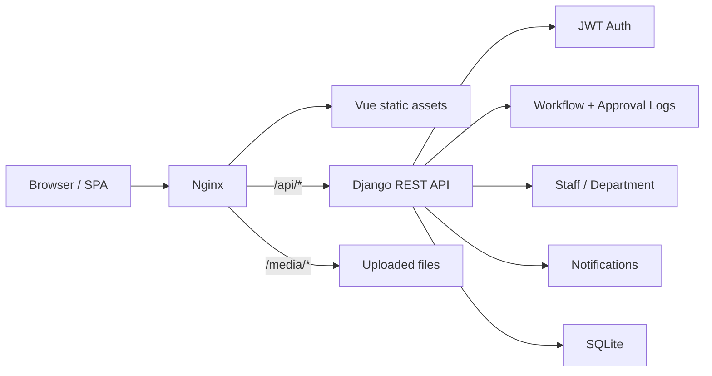

# Enterprise Workflow Approval Platform


A full-stack enterprise workflow approval platform for employee requests, approvals, announcements, and staff administration. The system is built as a realistic OA-style admin product: employees submit structured workflow requests, approvers process them with audit comments, and administrators manage staff, notices, and operational visibility from a dashboard.

## Why This Project

This project demonstrates practical full-stack product engineering rather than a single CRUD demo. It includes role-aware workflows, JWT authentication, searchable admin tables, file uploads, approval timelines, dashboard metrics, automated tests, and a Dockerized production deployment path.

## Feature Highlights

| Area | Capabilities |
|---|---|
| Authentication | JWT login, protected routes, password reset API, user state persistence |
| Workflow Center | Request creation, attachment upload, type-specific fields, status filtering, withdraw flow |
| Approval Todo | Approver/superuser visibility, approve/reject actions, required audit comments |
| Approval Timeline | Immutable action log for submit, approve, reject, and withdraw events |
| Notifications | Publish announcements, department targeting, read/unread tracking, pinned ordering |
| Employee Management | Staff filters, permission-aware forms, CSV export for selected employees |
| Dashboard | Approval todo count, personal request metrics, latest announcements, staff chart |
| Deployment | Docker Compose, Nginx SPA hosting, Gunicorn API, static/media handling |

## Tech Stack

| Layer | Stack |
|---|---|
| Frontend | Vue 3, Vite, Element Plus, Pinia, Vue Router, ECharts, wangEditor |
| Backend | Django 6, Django REST Framework, Simple JWT, WhiteNoise, Gunicorn |
| Data | SQLite for local/demo deployment |
| Testing | pytest, pytest-django, DRF APIClient |
| Deployment | Docker Compose, Nginx reverse proxy |

## Architecture



## Repository Layout

```text
src/                 Active Vue frontend
oaback/              Django backend
test/                pytest API and model tests
deploy/              Docker and Nginx deployment files
docker-compose.yml   Production-style local deployment
oafront/             Historical frontend copy, not active
```

## Demo Accounts

Created by `python manage.py seed_workflow` or by the Docker deployment when `DJANGO_SEED_DEMO_DATA=True`.

| Role | Email | Password |
|---|---|---|
| Admin | `admin@example.com` | `Admin@123456` |
| Employee | `employee@example.com` | `Employee@123456` |

## Local Development

Backend:

```bash
python3 -m venv venv
source venv/bin/activate
pip install -r oaback/requirements.txt
cd oaback
python manage.py migrate
python manage.py seed_workflow
python manage.py runserver
```

Frontend:

```bash
npm install
npm run dev
```

Development environment:

```env
VITE_BASE_URL=http://127.0.0.1:8000
VITE_APP_TITLE="Enterprise Workflow Approval Platform"
```

## Production Deployment

This repository includes a Docker Compose deployment that serves:

- Vue production assets through Nginx
- Django API through Gunicorn
- `/api/*` reverse proxy from Nginx to Django
- `/media/*` and `/api/media/*` uploaded files
- Django admin static files from collected static assets

Create a local deployment environment file:

```bash
cp .env.deploy.example .env.deploy
```

Edit `.env.deploy` before exposing the app publicly:

```env
DJANGO_DEBUG=False
DJANGO_SECRET_KEY=change-this-to-a-long-random-production-secret
DJANGO_ALLOWED_HOSTS=your-domain.com,www.your-domain.com
DJANGO_CORS_ALLOW_ALL_ORIGINS=False
DJANGO_CORS_ALLOWED_ORIGINS=https://your-domain.com,https://www.your-domain.com
DJANGO_CSRF_TRUSTED_ORIGINS=https://your-domain.com,https://www.your-domain.com
DJANGO_SECURE_SSL_REDIRECT=True
DJANGO_SESSION_COOKIE_SECURE=True
DJANGO_CSRF_COOKIE_SECURE=True
DJANGO_SECURE_HSTS_SECONDS=31536000
DJANGO_SECURE_HSTS_INCLUDE_SUBDOMAINS=True
DJANGO_SECURE_HSTS_PRELOAD=True
DJANGO_USE_X_FORWARDED_PROTO=True
DJANGO_SEED_DEMO_DATA=True
```

Start the deployment:

```bash
docker compose up -d --build
```

Useful commands:

```bash
docker compose ps
docker compose logs -f
docker compose exec backend python manage.py createsuperuser
docker compose down
```

## API Surface

| Method | Path | Description |
|---|---|---|
| POST | `/auth/login` | JWT login |
| GET | `/workflow/categories` | List active workflow request types |
| GET | `/workflow/requests?scope=mine\|todo\|all` | List requests by visibility scope |
| POST | `/workflow/requests` | Submit a workflow request |
| GET | `/workflow/requests/<id>` | Request detail with approval logs |
| PUT | `/workflow/requests/<id>/approve` | Approve a pending request |
| PUT | `/workflow/requests/<id>/reject` | Reject a pending request |
| PUT | `/workflow/requests/<id>/withdraw` | Withdraw own pending request |
| GET | `/workflow/summary` | Dashboard metrics |
| GET | `/inform/inform` | Notification list with filters |
| GET | `/staff/download` | CSV export for selected staff |

## Workflow Rules

- Employees can create requests and view their own submissions.
- Employees can withdraw only their own `pending` requests.
- Approvers and superusers can approve or reject pending requests.
- Applicants cannot approve their own requests.
- Every submit, approve, reject, and withdraw action creates an audit log entry.
- Date-range request types require `start_date` and `end_date`.
- Amount request types require a positive `amount`.

## Quality Checks

```bash
npm run build
python -m pytest test -q
python oaback/manage.py check --deploy
```

Current test coverage includes authentication, announcements, legacy leave APIs, staff export, models, and workflow APIs.

## Project Positioning

This project is suitable for presenting as:

- A full-stack Vue + Django portfolio project
- A production-minded admin platform case study
- Evidence of REST API design, role-based workflow logic, UI polish, testing, and Docker deployment

For resume, LinkedIn, and GitHub profile wording, see [docs/PROFILE_COPY.md](docs/PROFILE_COPY.md).

## Notes

- `oafront/` is a historical duplicate of the frontend. The root `src/` frontend is the active implementation.
- The public Cloudflare quick tunnel used for demos is temporary. For a permanent URL, use a named Cloudflare Tunnel with a custom domain or deploy this Docker Compose stack on a cloud VM.
